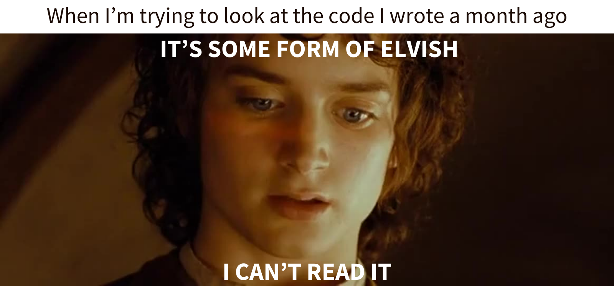

<!--
- 🔭 I’m currently working on ...
- 🌱 I’m currently learning ...
- 👯 I’m looking to collaborate on ...
- 🤔 I’m looking for help with ...
- 💬 Ask me about ...
- 📫 How to reach me: ...
- 😄 Pronouns: ...
- ⚡ Fun fact: ...
-->

# Hi there 👋
I am a Computer Engineering student in Yildiz Technical University and I'm in my last year at the moment. I am mostly interested in Game Development and Artificial Intelligence.  

I'm currently focused on learning HTML - CSS - Javascript to expand my knowledge in Frontend development.

### Languages:
 Turkish - Native  
 English - Advanced (C1)

### Programming Languages and Tools I'm Familiar With:

### Contact:

